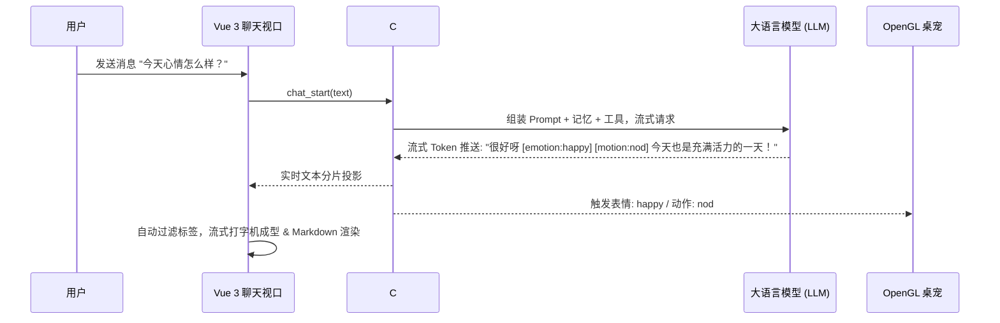

# AI 对话与 Agent 配置

Nori Desktop Pet 内置多模型智能 Agent 交互核心，支持与国内外主流大语言模型（LLM）建立流式对话，并具备打字机实时渲染、动作/表情指令解析以及安全工具调用能力。

---

## 1. 支持的模型服务商（Providers）

在主控制台的 **「设置」→「AI 设置」** 中，可选择并配置以下协议适配器：

<UiAiSettingsPreview />

| 协议类型 (Provider) | 默认 Base URL | 适用模型与服务商示例 |
| :--- | :--- | :--- |
| **`openai` (推荐)** | `https://api.openai.com/v1` | • OpenAI (GPT-4o, o3-mini)<br>• **DeepSeek** (deepseek-chat, deepseek-reasoner)<br>• **Ollama** 本地运行模型 (`http://127.0.0.1:11434/v1`)<br>• 通义千问 (Qwen)、Moonshot (Kimi)、SiliconFlow 等兼容接口 |
| **`openai_responses`** | `https://api.openai.com/v1` | OpenAI 最新 Responses 协议 |
| **`anthropic`** | `https://api.anthropic.com/v1` | Claude 3.5 Sonnet / Claude 3.7 Sonnet |
| **`google`** | `https://generativelanguage.googleapis.com/v1beta` | Google Gemini 2.0 Flash / Pro 系列 |

---

## 2. 连通性测试与安全存储

### 一键拉取与连接测试

- **获取模型列表 (`llm_fetch_models`)**：填入 Base URL 与 API Key 后，点击「拉取模型」即可自动获取该服务商账号下所有可用模型并填入下拉列表。
- **无状态探测测试 (`llm_test_connection`)**：提供「测试连接」按钮，向指定端点发送固定探测消息：
  - **绝不持久化测试内容**：测试过程不写入 SQLite 聊天数据库与长期记忆库。
  - **异常自动脱敏**：网络超时、认证失败或模型不存在时，给出直观中文提示。

### 凭据加密存储 (`nsec1:`)

所有 API Key 在落盘至 SQLite 时均采用 **AES-256-GCM** 加密：
```text
nsec1:<base64(12字节Nonce | 密文 | 16字节Tag)>
```
主加密密钥通过操作系统底层安全容器保护（Windows DPAPI、macOS Keychain、Linux libsecret）。前端快照仅返回 `hasApiKey: true/false`，明文密钥绝不跨 Bridge 回传。

---

## 3. 流式打字机与动作/表情标签

在 **「对话 (Talk)」** 视图中，Nori 提供媲美现代聊天客户端的流式交互体验：

<UiChatPreview />



### 动作与表情标签提取规范

Nori 内部引擎在流式接收 Token 时会自动捕获以下控制标记：
- **`[motion:动作名称]`**：驱动 Live2D 播放指定动作（如 `nod`、`wave`、`shake`、`tap_head`）。
- **`[emotion:表情名称]`**：驱动 Live2D 切换指定表情（如 `happy`、`shy`、`surprised`、`sad`）。
- **纯净文本投影**：前端在渲染气泡时会自动剥离上述标签，保证最终呈现给用户的回答温润自然。

---

## 4. 人设 Prompt 与上下文预算管理

### 角色人设（Persona Prompt）

系统内置了经过精心调校的 Nori 伴侣人设模版：
- 自然温润的说话口吻，带有适度的俏皮与关心。
- 支持在 **「AI 设置」→「自定义人设 (Persona)」** 中进行个性化覆盖或追加自定义要求。

### 上下文预算管理（Context Budget）

为了防止长上下文导致 API 费用失控或超出模型 Token 上限，`ContextBudget.cs` 实现了严格的滑动窗口管理策略：
1. **优先保留**：系统 Prompt、当前 Nori 角色人设、检索召回的长期记忆事实。
2. **滑动淘汰**：根据模型的上下文容量（如 8k / 32k / 128k），自动截断过旧的轮次，保证核心对话逻辑的高效稳定。
