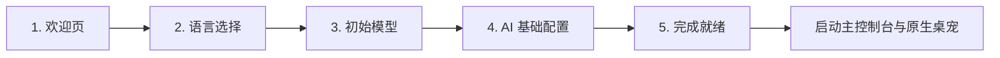

# 快速上手指南

本指南将帮助你从零开始准备运行环境、启动 **Nori Desktop Pet** 并完成首次初始化向导。

---

## 1. 运行环境与前置准备

Nori Desktop Pet 是基于 **.NET 10** 与 **Avalonia 12** 宿主构建的桌面智能伴侣。当前版本采用 **Framework-Dependent（依赖系统运行时）** 形式分发，发布包体积小巧且不强制捆绑冗余运行库。

### 操作系统支持矩阵

| 平台 | 当前支持状态 | 必要系统依赖 |
| :--- | :--- | :--- |
| **Windows x64** | **正式发布与主要验收平台** | • [.NET 10.0 Desktop Runtime (x64)](https://dotnet.microsoft.com/download/dotnet/10.0)<br>• [Microsoft Edge WebView2 Evergreen Runtime](https://developer.microsoft.com/microsoft-edge/webview2/) |
| **macOS (Apple Silicon / Intel)** | 源码编译与单元测试保障 | • .NET 10 SDK / Runtime<br>• 系统原生 WebKit (自带) |
| **Linux (x64)** | 源码编译与单元测试保障 | • .NET 10 SDK / Runtime<br>• `libwebkit2gtk-4.1-0`、GTK3、OpenGL 支持 |

::: warning 实事求是说明
- **Windows x64** 是目前完成完整端到端发布验证与桌宠透明窗口验收的平台。
- macOS 和 Linux 目前由自动化 CI 确保编译通过和核心单元测试通过，未打包独立发布安装资产。
- 本程序**未内置大语言模型权重**，亦**不提供云端 Live2D 模型下载服务**。AI 对话需配置第三方或本地 LLM 接口，Live2D 模型需在本地安全导入。
:::

---

## 2. 安装与运行

### 方式一：使用发布包（Release ZIP）

1. 确认系统已安装 [.NET 10 Runtime](https://dotnet.microsoft.com/download/dotnet/10.0) 与 WebView2。
2. 解压 `Nori-Desktop-Pet-win-x64.zip` 到任意非系统受限目录（例如 `D:\NoriPet`）。
3. 双击运行 `Nori.Desktop.exe`。

### 方式二：从源码构建与开发调试

克隆仓库后，进入 `app/desktop` 目录：

```bash
# 1. 安装前端依赖并执行前端构建验证
pnpm install
pnpm build

# 2. 构建 .NET 后端
dotnet build

# 3. 运行完整应用 (生产模式：使用内建编译产物)
dotnet run --project Nori.Desktop

# 4. 开发者联调模式 (WebView 指向 Vite 实时热重载服务)
pnpm dev                                      # 终端 1：启动前端 Vite (:1420)
NORI_DEV=1 dotnet run --project Nori.Desktop # 终端 2：启动宿主
```

---

## 3. 本地数据存储路径

Nori 将配置数据库、本地 Live2D 资源、日志与记忆持久化在系统的标准数据目录下：

| 平台 | 数据根目录路径 |
| :--- | :--- |
| **Windows** | `%APPDATA%\cn.erhio.noriDesktopPet\data` (即 `C:\Users\<用户名>\AppData\Roaming\cn.erhio.noriDesktopPet\data`) |
| **macOS** | `~/Library/Application Support/cn.erhio.noriDesktopPet/data` |
| **Linux** | `$XDG_DATA_HOME/cn.erhio.noriDesktopPet/data` (默认 `~/.local/share/cn.erhio.noriDesktopPet/data`) |

数据目录内部主要结构：
```text
<data>/
├── nori.db           # SQLite 主数据库（配置、聊天、技能、MCP、记忆原子与向量）
├── logs/             # 运行日志（按日期滚动，脱敏记录）
├── resources/
│   └── live2d/       # 本地 Live2D 模型存放目录
└── plugins/          # NPS 2.0 插件安装与配置目录
```

---

## 4. 首次运行向导（First-Run Wizard）

首次启动 Nori 时，系统会自动弹出透明向导窗口 `first-run`，引导完成 5 步基础配置：

<UiWizardPreview />



### 步骤详解

1. **欢迎界面 (Welcome)**：展示 Nori 版本号与伴侣心声。
2. **界面语言 (Language)**：选择系统语言，支持 **简体中文 (zh-CN)** 与 **English (en-US)**，后续可在设置面板随时热切换。
3. **初始模型 (Model)**：
   - 检测本地已安装的官方模型：`arg-nori`（默认推荐）或 `nori`。
   - 选定后将作为原生桌宠的初始加载模型。
4. **AI 服务配置 (AI Setup - 可选)**：
   - 可直接填写常用提供商（如 OpenAI / DeepSeek / Claude / Gemini / Ollama 等）的 Base URL 与 API Key。
   - **此步骤允许跳过**：若暂不配置，稍后可在控制台的「AI 设置」中随时补充。
5. **完成与就绪 (Ready)**：
   - 呈现配置摘要与遥测日志授权选择（仅在用户同意时收集脱敏崩溃指标）。
   - 点击「进入世界」，宿主向数据库写入完成标记 `first_run_completed=1`，销毁引导窗并平滑唤起主控制台与原生桌宠。

---

## 5. 常用启动参数

| 命令行参数 | 说明 | 适用场景 |
| :--- | :--- | :--- |
| *(无参数)* | 正常启动应用，加载完整 Agent、Live2D、语音及后台服务。 | 日常使用 |
| `--safe-mode` | **安全排障模式**：跳过外部联网、MCP 自动连接与 Live2D 自动加载，保留 UI、配置修复与日志导出。 | 遇到启动崩溃、网络阻塞或死循环时人工排障 |
| `--smoke-test <mode> --profile <dir>` | 冒烟自动化测试：验证 `first-run` 或 `initialized` 就绪状态后自动退出。 | CI 持续集成与自动化验收 |
