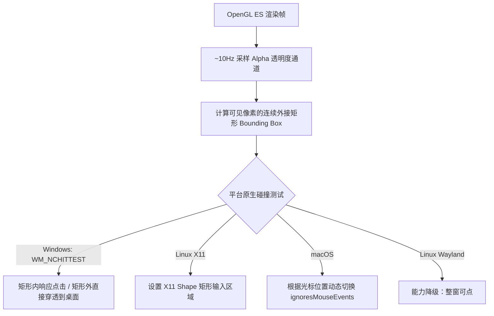

# Live2D 桌宠与模型管理

Nori Desktop Pet 的核心亮点之一在于**完全由 C# 原生 OpenGL ES 2.0 驱动的 Live2D 渲染管线**，结合智能 Alpha 碰撞检测，带来极度跟手的平滑拖拽与贴近模型轮廓的透明穿透体验。

---

## 1. 原生 OpenGL Live2D 引擎特性

区别于传统基于 Electron / Tauri 网页内 Canvas 渲染的方案，Nori 的桌宠视窗（`PetWindow`）直接在 Avalonia 的 `OpenGlControlBase` 上绘制：

- **高性能渲染底盘**：基于 `Live2DCSharpSDK` 与官方 Native Cubism Core，支持高达 2048×2048 的高精遮罩缓冲与 16x 各向异性过滤（Anisotropic Filtering）。
- **全物理与视线跟随**：原生计算头发与衣物物理摆动、呼吸起伏、自动自然眨眼与视线追踪（Mouse Cursor Tracking）。
- **音频驱动实时口型**：接收主控制台 WebAudio 传递的实时音频振幅（RMS），按分贝级别平滑驱动 Live2D 模型的口型开合（Lip Sync）。
- **动作与表情调度**：支持闲置循环动作（Idle Motion）、节拍同步（Beat Sync）以及随对话情绪标签触发的即时表情（Expressions）与特效动作。

---

## 2. 模型尺寸透明穿透与平滑拖拽

为了让桌宠自然融入桌面而不阻碍用户的正常办公与点击，Nori 实现了动态 Alpha 轮廓检测算法：



### 极度跟手的 4px 原生拖拽
- **防误触阈值**：按下鼠标左键并移动超过 `4px` 阈值后才判定为拖拽动作，避免轻微点击互动被误识别为移动。
- **坐标自动持久化**：松开鼠标后，桌宠视窗位置自动保存到 SQLite 数据库中，下次启动时自动恢复记忆位置。

---

## 3. 本地模型导入与安全机制

所有 Live2D 资源统一隔离存放于本地存储目录：

```text
<data>/resources/live2d/<model-id>/
```

### 官方标配模型

- **`arg-nori`**：ARG 深度微光定制版 Nori 模型（默认）。
- **`nori`**：经典版 Nori 伴侣模型。

::: tip 资源与安全边界说明
- Nori **不提供任何云端远程模型下载器或 CDN 分发**，发布包内也不附带未经授权的第三方商用模型。
- 所有自定义模型均通过**本地安全导入**管道载入。
:::

### 本地导入步骤（ZIP 压缩包 / 文件夹）

1. 进入主控制台的 **「模型」** 面板。
2. 点击 **「导入本地模型」** 按钮，选择 `.zip` 压缩包或解压后的模型文件夹。
3. 系统将自动在后台临时沙盒目录（`.staging/`）完成安全校验与格式解析，无误后原子化迁移至资源目录。

### 安全防护与 Zip Slip 防御

Nori 内置了极为严格的 `ZipExtractor` 路径安全审计：
- **阻断路径穿越**：严禁解压包含 `../`、`..\`、绝对路径（如 `/etc`、`C:\Windows`）或 UNC 路径（`\\server\share`）的条目。
- **阻断特殊符号与控制字符**：严禁包含符号链接（Symlink）与非法控制字符。
- **完整性校验**：必须包含合规的 `*.model3.json` 主配置文件，并严格校验贴图、动作与表情文件的相对引用有效性。

---

## 4. 设置面板实时预览与参数热调

在 **「模型」** 面板中，点击已安装模型的 **「调整」** 按钮，将展开内嵌 **PixiJS** 的实时配置视口：

<UiModelPreview />

```text
┌─────────────────────────────────────────────────────────────┐
│ 模型调整面板                                                │
├──────────────────────────────┬──────────────────────────────┤
│ 实时 PixiJS 预览视口         │ 渲染与行为参数               │
│ (2D/3D 双重渲染核验)         │ ├─ 模型缩放 (Scale): 0.5~2.0 │
│                              │ ├─ 透明度 (Opacity): 0~1.0   │
│                              │ ├─ 渲染倍率: 1x / 2x / 4x    │
│                              │ ├─ 帧率上限: 30 / 60 / 无限制│
│                              │ └─ 渲染品质: 自适应 / 高画质 │
├──────────────────────────────┴──────────────────────────────┤
│ 自定义触摸互动区域 (Interaction Regions)                    │
│ ├─ 头部 (Head)   → 触发动作: TapHead  → 表情: Smile         │
│ ├─ 脸颊 (Cheek)  → 触发动作: PokeFace → 表情: Shy           │
│ └─ 身体 (Body)   → 触发动作: TapBody  → 表情: Normal        │
└─────────────────────────────────────────────────────────────┘
```

### 触摸区域可视化编辑（Region Overlay）
- 可直观在模型上方通过矩形选框绘制敏感交互区域（如头部、脸颊、胸口、手臂）。
- 为每个区域绑定独立的动作组（Motions）与表情（Expressions），当在桌面上点击对应部位时即刻触发对应的灵动反馈。
- 配置支持**独立字段防抖自动保存**（400ms），并在保存成功后实时热重载至桌宠原生窗口。
