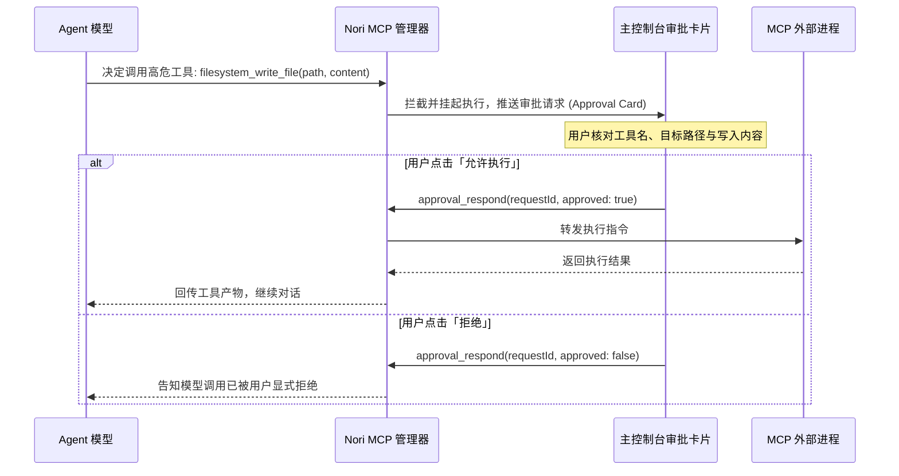

# MCP 协议扩展集成

Nori Desktop Pet 全面支持 **Model Context Protocol (MCP)** 开放标准，允许为伴侣 Agent 无缝接入海量的外部工具、本地数据源与第三方服务生态。

---

## 1. 什么是 MCP 与核心运行模式

MCP（模型上下文协议）是由 Anthropic 主导的标准通信协议。通过 MCP，Nori 可以安全地调用本地文件系统、执行终端命令、查询数据库或调用网络 API。

### Nori 支持的两种传输模式（Transports）

1. **`stdio` 管道传输（主流推荐）**：
   - 宿主直接拉起子进程并通过标准输入/输出流通信。
   - 适用于 Node.js (`npx`)、Python (`uvx` / `python`) 等本地命令行服务。
2. **`sse` 服务端事件流传输**：
   - 通过 HTTP Server-Sent Events 与常驻或远程服务器通信。
   - 适用于 Docker 容器或局域网服务。

---

## 2. 配置与管理 MCP 服务器

进入主控制台的 **「设置」→「MCP」**，点击 **「添加服务器」**：

```text
┌────────────────────────────────────────────────────────┐
│ 添加 MCP 服务器                                        │
├────────────────────────────────────────────────────────┤
│ 服务名称: 本地文件系统 (Filesystem)                   │
│ 传输协议: [ Stdio ]                                    │
│ 执行命令: npx                                          │
│ 运行参数: -y @modelcontextprotocol/server-filesystem   │
│           C:\Users\SakuraStar\Desktop                  │
│ 环境变量: KEY=VALUE (可选)                             │
│ 开关设置: [x] 启用服务   [x] 启动时自动连接            │
└────────────────────────────────────────────────────────┘
```

### 常见实用 MCP 服务器配置示例

#### 1. 文件系统操作 (`@modelcontextprotocol/server-filesystem`)
- **Transport**: `stdio`
- **Command**: `npx`
- **Args**: `["-y", "@modelcontextprotocol/server-filesystem", "C:\\Workspace"]`

#### 2. 网页内容抓取与检索 (`fetch`)
- **Transport**: `stdio`
- **Command**: `uvx`
- **Args**: `["mcp-server-fetch"]`

#### 3. GitHub 仓库管理 (`@modelcontextprotocol/server-github`)
- **Transport**: `stdio`
- **Command**: `npx`
- **Args**: `["-y", "@modelcontextprotocol/server-github"]`
- **Environment**: `{"GITHUB_PERSONAL_ACCESS_TOKEN": "ghp_..."}`

---

## 3. 工具发现、手动调试与人工审批机制

<UiMcpPreview />



### 3.1 工具列表与手动测试
- 在「MCP 设置」中切换至 **「内置与工具」** 标签页，可查看所有已连接服务暴露的 Tool 函数签名与参数 Schema。
- 提供 **手动测试运行窗口**，方便开发者在不消耗对话 Token 的情况下直接验证单项工具的输入与输出。

### 3.2 人工在环二次审批（Human-In-The-Loop）
- 对于涉及文件写入、外部修改或敏感操作的工具，Nori 的 Agent 会在聊天视口中弹出明晰的 **审批卡片（Approval Drawer）**。
- 只有在用户亲自确认无误并点击「批准」后，外部进程才会真正执行，彻底杜绝大模型“幻觉”导致的破坏性误操作。
