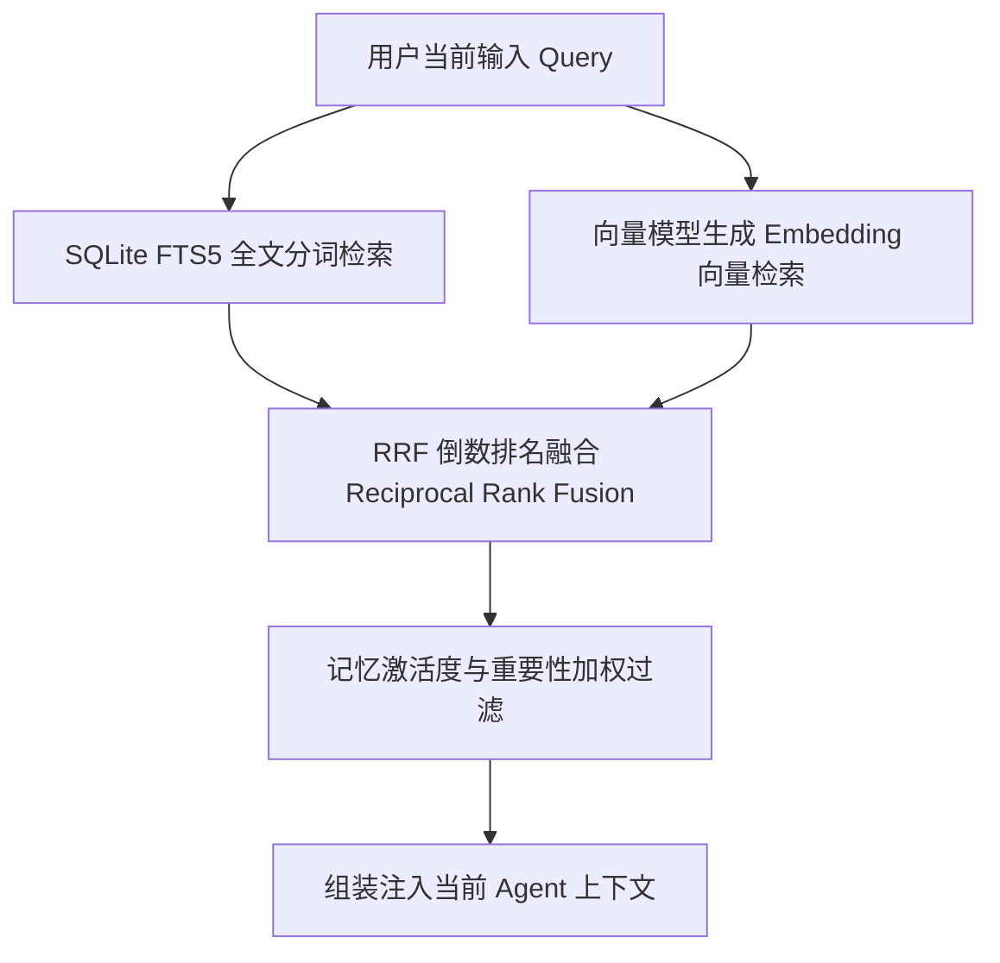

# Living Memory 长期记忆与知识库

为了让桌面伴侣真正拥有“陪伴与成长”的温度，Nori Desktop Pet 构建了一套基于认知心理学原理的 **Living Memory（活体记忆系统）** 与多路混合检索体系。

---

## 1. 记忆运行时契约（Memory Runtime Contract）

Nori 严格遵循 `Memory.md` 定义的核心认知契约：

::: tip 核心认知原则
- **后台知道某件事是真的 ≠ Nori 当前记得这件事**
- **检索到了某条资料 ≠ Nori 突然恢复全部记忆**
- **知道完整时间线 ≠ 每次回答都要向用户背诵完整时间线**
:::

### 状态认知分层标签

系统在检索与注入背景信息时，严格区分以下状态：

| 认知标签 | 定义与含义 | 伴侣在对话中的行为表现 |
| :--- | :--- | :--- |
| **`[WORLD_FACT]`** | 世界客观事实与设定真相 | 后台逻辑已知，但若非角色设定已知，Nori 不会主动假装自己亲历过。 |
| **`[ARCHIVE_RECORD]`** | 邮件、日志、文档等冷证据 | 作为客观依据存在，不代表单一解释。 |
| **`[NORI_KNOWS]`** | 当前 Nori 明确记得的内容 | 可以自然、自信地说出与引用（如用户的姓名、喜好、共同约定）。 |
| **`[NORI_ECHO]`** | 模糊残响与潜意识波动 | 遇到特定关键词时触发隐约的熟悉感（*“总觉得这个名字很熟悉……”*），但不能直接倒背如流。 |

---

## 2. 三路混合检索与 RRF 融合算法

为了兼顾关键词精确命中（如特定人名、端口号、代码名词）与语义相似度模糊匹配，Nori 实现了 **三路混合检索（Hybrid Retrieval）**：

### RRF 倒数排名融合算法

对全文搜索与向量搜索的排序结果计算综合得分：
$$RRF\_Score(d) = \sum_{m \in \{fts, vec\}} \frac{1}{k + rank_m(d)}$$
其中常数 $k$（默认取 60）有效平衡不同检索通道的分值偏差，确保召回结果精准无死角。

### Embedding 向量模型配置

在 **「设置」→「AI 设置」→「Embedding 配置」** 中，可独立配置向量化模型：
- **本地端点**：如 Ollama (`http://127.0.0.1:11434/v1`，模型 `bge-m3` 或 `nomic-embed-text`)。
- **云端服务商**：OpenAI (`text-embedding-3-small`) 或兼容提供商。
- **全量重嵌入 (`memory_reembed_all`)**：更换向量模型或维度后，可一键对历史记忆重新生成向量索引。

---

## 3. 记忆原子与分类生命周期

每条记忆在沉淀时都会细化为结构化的 **记忆原子（Memory Atom）**：

- **类别（Kind）**：
  - `preference`（用户偏好：如爱喝乌龙茶、编程用 Python）
  - `factual`（客观事实：如居住在上海、生日）
  - `relational`（关系状态：如朋友、工作伙伴）
  - `planned`（待办计划：如明天下午有会议）
  - `identity`（身份认同）与 `general`（通用信息）
- **重要度（Importance）** 与 **置信度（Confidence）**（0.0 ~ 1.0）。
- **状态流转**：`active` (活跃) → `dormant` (休眠) → `expired` (已过期/归档)。

---

## 4. 后台反思整理（Reflection）与记忆管理

### 自主反思机制 (Reflection)

- **周期触发**：在 **「设置」→「记忆」** 中可配置反思触发轮次（默认每 8 轮对话）。
- **后台整理**：系统在后台合并重复记忆、解决语义冲突、更新已失效的事实，无需用户手动干预。

### 记忆面板管理功能

<UiMemoryPreview />

在主控制台的 **「记忆 (Memory)」** 一级页面中，提供全套可视化管理工具：
1. **概览与统计**：查看当前活跃记忆数、原子总数与向量化进度。
2. **全文搜索与过滤**：按关键词、类型、状态即时筛选。
3. **手动录入与编辑**：允许手动添加或修改记忆原子内容与标签。
4. **导入导出与冲突解决**：
   - 导出为标准的脱敏 JSON 文件。
   - 导入时提供预览，并支持「保留现有」、「覆盖冲突」或「智能合并」策略。
