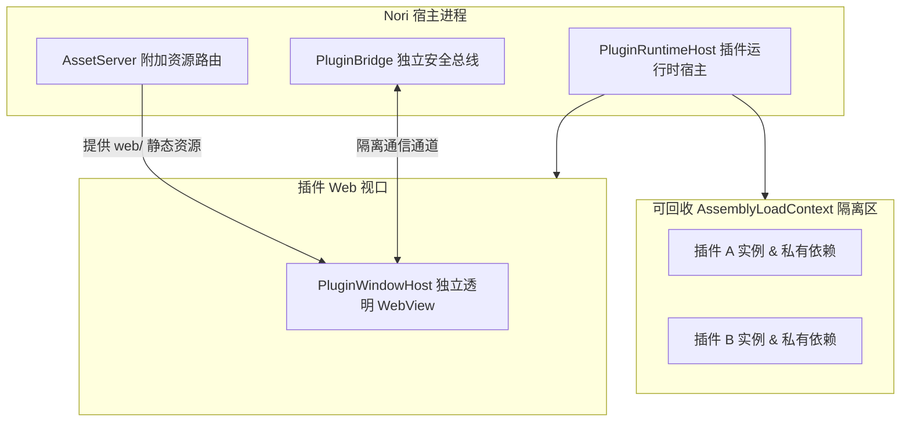

# 插件系统 (NPS 2.0)

Nori Plugin Specification 2.0（NPS 2.0）是专为 Nori Desktop Pet 打造的轻量级受信任进程内扩展基础设施。

---

## 1. 核心架构与安全定位



::: warning 受信任扩展边界认知
- 插件属于 **.NET 进程内扩展**。
- `AssemblyLoadContext`（ALC）用于**依赖隔离与尝试卸载**，**不是操作系统级安全沙箱**。
- 请仅安装来自可信来源或自行编译审查过的 `.noripack` 插件包。
:::

---

## 2. `.noripack` 插件包结构与清单规范

`.noripack` 是符合特定目录布局的 ZIP 压缩包：

```text
my-plugin.noripack (ZIP)
├── manifest.json       # 核心元数据与清单配置 (必需)
├── README.md           # 插件说明文档 (可选)
├── icon.png            # 插件图标 (可选)
├── lib/                # 托管程序集入口及私有依赖 DLL
│   └── MyPlugin.dll
└── web/                # 插件前端公开 Web 资源 (HTML/CSS/JS)
    └── index.html
```

### `manifest.json` 示例与字段要求

```json
{
  "schemaVersion": 1,
  "id": "io.nori.pomodoro",
  "name": "Nori 番茄钟",
  "description": "为桌宠添加精美的番茄工作法悬浮时钟与专注统计",
  "version": "1.0.0",
  "authors": [{ "name": "Nori Community" }],
  "apiVersion": "2.0",
  "minHostVersion": "1.0.0",
  "runtime": {
    "kind": "dotnet",
    "assembly": "lib/MyPlugin.dll",
    "entryType": "Nori.Plugins.PomodoroPlugin"
  },
  "ui": { "webRoot": "web" },
  "capabilities": ["ui.webview"],
  "platforms": ["windows", "linux", "macos"]
}
```

- **`apiVersion`**：必须与宿主主版本匹配（当前为 `2.0`）。
- **`capabilities`**：当前标准宿主能力为 `ui.webview`（提供透明 Web 独立窗口与桥接）。

---

## 3. 插件管理与生命周期

<UiPluginsPreview />

在主控制台的 **「设置」→「插件」** 面板中，提供全套可视化管理：

- **本地安装**：点击「安装本地插件」，选择 `.noripack` 包，系统将自动进行格式合规性检查并解压至 `<data>/plugins/<pluginId>/`。
- **动态启用与禁用**：无需重启主应用即可通过创建/回收 `AssemblyLoadContext` 完成插件的热插拔。
- **安全卸载**：支持在卸载时选择是否保留插件的私有本地存储（`PluginStorage`）。
- **安全模式豁免**：以 `--safe-mode` 启动时，所有插件将强制保持未加载状态，确保核心系统稳定。
