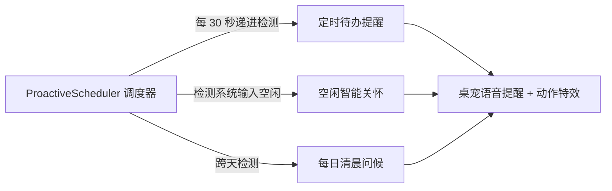

# 技能扩展与定时提醒

Nori Desktop Pet 不仅是一个对话窗口，更具备**可编程技能体系**与**主动生活关怀调度器**。

---

## 1. 技能体系（Skills System）

技能（Skill）允许为 Nori 注入特定领域的专长 Prompt、行为准则与可用工具权限集合。

### 1.1 内置技能市场与分类

在主控制台的 **「设置」→「技能」** 中，可浏览并一键启用预设技能：

| 分类 | 代表技能示例 | 技能说明 |
| :--- | :--- | :--- |
| **编程专精 (Coding)** | 代码审查助理 (Code Reviewer) | 专注于代码分析、Bug 诊断与重构建议。 |
| **生产力 (Productivity)** | 待办管家 (Task Organizer) | 协助规划每日日程、整理待办事项与要点备忘。 |
| **日常陪伴 (Life)** | 游戏玩伴 (Gaming Partner) | 充满活力的联机玩伴模式，分享游戏趣事与吐槽。 |
| **角色扮演 (Roleplay)** | 沉浸式伴侣设定 | 强化特定世界观与专属人设互动。 |

### 1.2 自定义技能包编写与导入

支持通过可视化表单或 JSON 文件创建自定义技能：

```json
{
  "id": "custom.translator",
  "name": "多语言实时翻译",
  "description": "提供地道、精准的双语对照互译与润色",
  "author": "User",
  "version": "1.0.0",
  "category": "productivity",
  "tags": ["translation", "english", "japanese"],
  "instructions": "你是一名精通多国语言的同声传译专家。请直接给出精准的翻译译文与词汇解析...",
  "tools": ["getTime"],
  "enabled": true
}
```

- **导入与导出**：支持导出自定义技能包分享给他人，或通过 URL 直接安装网络技能包。

---

## 2. 定时提醒与主动感知调度（Proactive Scheduler）

<UiSkillsPreview />

在 **「设置」→「主动行为」** 中，Nori 提供了细致的生活管家功能：



### 2.1 倒计时与定时提醒（Reminders）

- **快速创建**：支持在对话中直接自然语言创建（*“20 分钟后提醒我喝水”*）或在面板中手动添加。
- **状态流转**：
  - 到达设定时间时，桌宠做出提醒动作并弹出通知。
  - 支持 **推迟（Snooze）**（延迟 5/10/15 分钟再次提醒）或 **标记完成（Complete）**。

### 2.2 空闲感知与主动问候（Proactive Idle & Greeting）

- **空闲关怀 (Idle Check-in)**：可设置空闲触发时长（例如 15 分钟）。当检测到用户长时间未操作鼠标/键盘时，Nori 会轻声询问是否在休息或需要放松。
- **每日问候 (Daily Greeting)**：每天首次启动或回到电脑前时，自动触发贴心的早间问候。
- **安全模式防护**：当以 `--safe-mode` 启动时，主动调度器会自动休眠，防止非预期的打扰。
