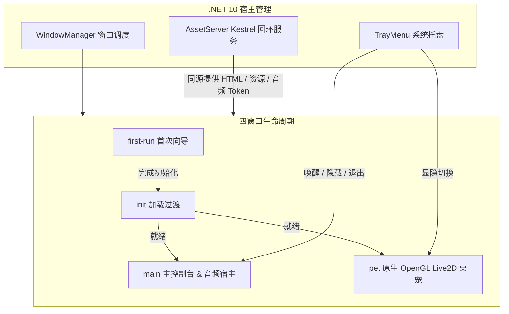

# 界面与四窗口隔离架构

Nori Desktop Pet 采用**四独立窗口分权调度**与**宿主回环资产总线**设计，彻底解决传统桌宠在 WebView 空域冲突（Airspace Issue）、透明窗穿透与音频跨窗口分裂上的痛点。

---

## 1. 四窗口生命周期设计

系统定义了四个职责严格隔离的独立窗口（均采用 `WindowDecorations.None` 无边框与透明背景）：

### 1.1 首次向导窗口 (`first-run`)
- **承载形态**：`NativeWebView` 承载前端向导 SPA（路由指向 `?window=first-run`）。
- **权限边界**：具备特权执行 `complete_first_run` 写入初始化标记。完成向导后立即销毁并释放资源。

### 1.2 初始化中转窗口 (`init`)
- **承载形态**：轻量级 NativeWebView。
- **解决竞态**：首次运行完成时，`init` 窗口可能尚未完成页面挂载。Nori 采用 **“先订阅广播，再调用 `init_ready` 消费 pending 标记”** 的状态握手协议，杜绝事件丢失导致的加载圈死锁，并附带 10 秒超时保底机制。

### 1.3 主控制台窗口 (`main`)
- **承载形态**：NativeWebView 承载的核心管理控制台（路由 `?window=main`）。
- **唯一常驻音频宿主**：主窗口在关闭（点击右上角叉号）时**仅执行隐藏（Hide），不销毁进程**。这样设计让全应用的 WebAudio 播放器、TTS 播放队列与麦克风录音常驻于单一上下文，彻底杜绝了多窗口切换时音频状态断裂与冲突。

### 1.4 原生桌宠窗口 (`pet`)
- **承载形态**：Avalonia 原生 `PetWindow`，内部直接挂载 `PetGlControl`（基于 OpenGL ES 2.0）。
- **技术优势**：绕过任何浏览器的 WebView 渲染层，直接调用 Native C# OpenGL 绘制 Live2D 模型，从根本上消除了窗口透明穿透、显卡兼容性白边与性能损耗。

---

## 2. Kestrel 回环服务与安全资产隔离

为了在跨平台 WebView 中安全、高效地加载本地模型、前端界面与音频数据，Nori 内置了基于 ASP.NET Core Kestrel 的轻量回环服务（`AssetServer`）：

- **端口与绑定**：绑定于本地回环地址 `127.0.0.1`，启动时自动生成唯一的**随机 Hex 路径密钥**（如 `http://127.0.0.1:54321/a8f1b2c3/app/`）。
- **Host 头与路径校验**：校验所有 HTTP 请求的 `Host` 头，阻断非本机与恶意跨站嗅探。
- **一次性媒体 Token（One-Time Media Token）**：
  - TTS 音频流通过动态生成的临时 Token 端点（`GET /{secret}/media/tts/{token}`）提供，前端 WebAudio 消费完毕后立即自动失效。
  - 麦克风录音数据通过带时效的 Token 端点（`POST /{secret}/media/record/{token}`）回传。
  - **杜绝将巨大音频 Base64 塞入 JSON Bridge**，保障 UI 交互的绝对流畅。

---

## 3. 双层 JSON 桥接通信规范

前端 Vue 3 与 .NET 宿主之间的通信基于高性能原生桥接封装：

1. **JS → 宿主命令（Invoke）**：
   - 前端通过统一入口 `invoke(commandName, args)` 调用后端。
   - 所有命令在 `BridgeCommands.cs` 中进行显式模式匹配与窗口来源鉴权（例如 `RequireMain`、`RequireLabel`）。
2. **宿主 → 前端事件（Event Broadcast）**：
   - 宿主通过 `InvokeScript` 发送 JSON 事件包。
   - 采用**双层编码（Double-Encoded JSON Envelope）**：宿主先序列化数据包为标准 JSON 字符串，再将其转义注入脚本。前端接收后 `JSON.parse` 解构，从根源上杜绝了多平台字符串转义漏洞与乱码。
3. **响应式 UI 快照（UI Snapshot）**：
   - 状态变更后，宿主触发快照失效广播（`InvalidateSnapshot`），前端组件统一消费强类型的响应式状态快照，避免了分散的零碎请求。

---

## 4. 系统托盘与主界面导航

### 系统托盘交互

- **左键单击**：直接唤出或置顶主控制台窗口 (`main`)。
- **右键菜单**：
  - `显示/隐藏桌宠`：快速切换原生桌宠窗口的可见性。
  - `打开主控制台`：唤出管理面板。
  - `退出应用`：执行显式安全关机（保存配置、释放模型与 SQLite 事务并正常退出）。
- **能力自适应降级**：部分 Linux 桌面环境可能缺失 `StatusNotifier` 规范；当托盘安装失败时，宿主将 `supportsTray` 标记置为 `false`，主控制台界面会自动渲染常驻的桌宠显隐开关，确保功能可用。

### 主控制台核心面板结构

<UiMainControlPreview />

主控制台左侧提供 5 大核心导航板块：

| 导航标签 | 对应核心功能 | 简要说明 |
| :--- | :--- | :--- |
| **主页 (Home)** | 伴侣角色舞台与运行状态 | 查看当前陪伴模型、AI 服务连通性、活跃技能与社区快捷入口。 |
| **对话 (Talk)** | AI 对话与实时交互 | 支持流式打字机、Markdown 渲染、实时动作/表情驱动与工具审批。 |
| **模型 (Model)** | Live2D 模型管理与热调 | 模型安装状态概览、本地 ZIP 安全导入、Pixi 视口实时预览与触摸互动区域编辑。 |
| **记忆 (Memory)** | Living Memory 长期记忆库 | 浏览与检索记忆原子、知识库状态、向量混合检索调试与记忆导入导出。 |
| **设置 (Settings)** | 系统多维配置中心 | 包含 AI、语音、主动行为、技能、MCP、自动化、插件、系统与调试等分栏。 |
