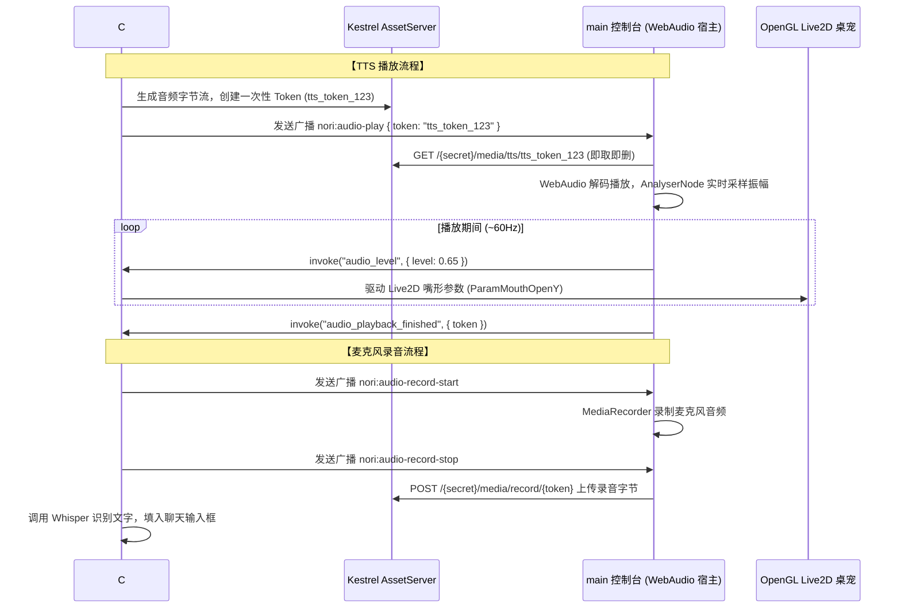

# 语音交互与口型同步

Nori Desktop Pet 配备了全链路语音交互管线，由 C# 后端 `VoiceService` 协同主控制台前端 WebAudio 共同驱动，支持高质量文本转语音（TTS）、语音识别（STT）以及毫秒级实时嘴形同步（RMS Lip Sync）。

---

## 1. 语音系统架构与一次性媒体令牌

为了在保障音质与低延迟的同时避免跨进程大体积数据传输阻塞，Nori 设计了独特的**双向媒体传输总线**：

---

## 2. TTS 语音合成提供商配置

在主控制台的 **「设置」→「语音设置」** 中，可选择以下 TTS 服务商：

<UiVoiceSettingsPreview />

### 2.1 云端 TTS 提供商

| 服务商 | 默认 Base URL | 特点与配置说明 |
| :--- | :--- | :--- |
| **OpenAI TTS** | `https://api.openai.com/v1` | 默认模型 `tts-1` / `tts-1-hd`，可选音色：`nova`, `alloy`, `echo`, `fable`, `onyx`, `shimmer`。 |
| **Google Gemini TTS** | `https://generativelanguage.googleapis.com/v1beta` | 采用 Gemini 官方语音生成能力。 |
| **MiniMax 语音** | `https://api.minimaxi.com/v1` | 极高品质的中文情感语音合成。 |
| **Custom HTTP** | 自定义 | 兼容标准 OpenAI 格式的第三方 HTTP 语音生成接口。 |

### 2.2 本地部署：GPT-SoVITS 深度集成

Nori 原生支持直连本地运行的 [GPT-SoVITS](https://github.com/RVC-Boss/GPT-SoVITS) 声音克隆引擎：
- **服务地址 (Base URL)**：默认 `http://127.0.0.1:9880`。
- **参考音频 (Reference Audio)**：本地参考样音路径（例如 `C:\voice\nori_ref.wav`）。
- **参考文本 (Prompt Text)** 与 **语种 (Prompt Language)**：参考样音所对应的文字与语言（中文/日文/英文）。
- **音质优势**：在本地显卡支持下，可实现极高还原度的专属二次元定制音色。

---

## 3. STT 语音识别（Whisper）配置

- **服务商选择**：支持标准 OpenAI Whisper API 或本地自建 Whisper HTTP 服务（如 `faster-whisper` / `whisper.cpp`）。
- **麦克风交互**：
  - 在聊天输入框旁点击麦克风图标开启录音。
  - 录音完成后自动上传并由 Whisper 转换为文本，无需键盘打字即可与 Nori 畅聊。

---

## 4. 实时 RMS 嘴形同步原理

- **振幅精确采样**：`main` 窗口在播放 WebAudio 时，通过 `AnalyserNode.getByteFrequencyData` 计算音频的均方根能量值（RMS）。
- **动态映射曲线**：将分贝动态范围映射至 `[0.0, 1.0]` 的平滑过渡值。
- **桌宠原生响应**：宿主收到振幅后，在每个渲染帧无缝插值应用到 Live2D 模型的 `ParamMouthOpenY`（嘴巴开合）与 `ParamMouthForm`（口型形态），彻底告别死板的机械循环动作，实现真实生动的说话表现。
