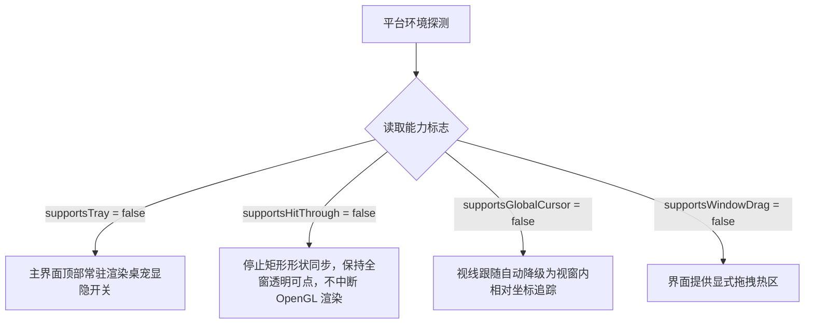

# 跨平台支持与能力降级矩阵

Nori Desktop Pet 依托 .NET 10 + Avalonia 12 的跨平台底座开发，但受限于不同桌面显示服务器（Display Server）与窗口协议的物理特性，各平台在特性支持度与降级方案上存在差异。

---

## 1. 跨平台支持矩阵对照表

| 核心特性 | Windows x64 (正式发布) | Linux (X11) | Linux (Wayland) | macOS (Apple Silicon / Intel) |
| :--- | :---: | :---: | :---: | :---: |
| **发布与验收状态** | **正式发布 Blocker** | 源码编译 / 单测保障 | 源码编译 / 单测保障 | 源码编译 / 单测保障 |
| **NativeWebView 引擎** | WebView2 Evergreen | WebKitGTK 4.1 | WebKitGTK 4.1 | WKWebView |
| **Live2D 原生 OpenGL** |  支持 (OpenGL ES 2.0) |  支持 (依赖显卡驱动) |  支持 (依赖显卡驱动) |  支持 (依赖驱动) |
| **模型尺寸透明穿透** |  `WM_NCHITTEST` |  X11 Shape 矩形 |  **降级为整窗可点** |  动态切换忽略鼠标 |
| **全局光标视线追踪** |  原生支持 |  原生支持 |  **降级为窗内追踪** |  原生支持 |
| **窗口原生拖拽** |  4px 原生拖拽 |  `_NET_WM_MOVERESIZE` | ️ 依赖能力标志 |  AppKit 拖拽 |
| **系统托盘 (Tray)** |  支持 | ️ 依赖 StatusNotifier | ️ 视桌面环境而定 |  支持 |
| **自动化 (Automation)** |  支持 (Edge) |  不支持 |  不支持 |  不支持 |
| **凭据密钥库** | Windows DPAPI | libsecret / 受限文件 | libsecret / 受限文件 | macOS Keychain / 受限文件 |

::: tip 验收口径说明
上表中的“支持”指代码路径与抽象层已就绪并经单元测试覆盖。**Windows x64** 是目前完成实际桌面端物理全体验收的平台，发布说明不宣称 macOS / Linux 已提供免编译开箱即用的正式二进制包。
:::

---

## 2. 能力驱动的优雅降级机制（Feature Degradation）

宿主在启动时通过 `IPlatformServices.Capabilities` 精确探测当前环境能力，并将状态注入 UI 快照：

### 关键降级场景处理

1. **Linux Wayland 协议限制**：
   - Wayland 出于安全设计，默认禁止应用获取全局光标坐标与自定义窗口输入穿透形状。
   - Nori 在 Wayland 下自动平滑降级为**整窗可点**与**窗内视线跟随**，OpenGL 物理渲染依然保持 60fps 稳定输出，绝不抛出未经处理的崩溃异常。
2. **托盘缺失场景**：
   - 当在无 StatusNotifier 扩展的 GNOME 等桌面环境运行时，主控制台会自动呈现备用控制按钮，确保用户随时能找回桌宠。
