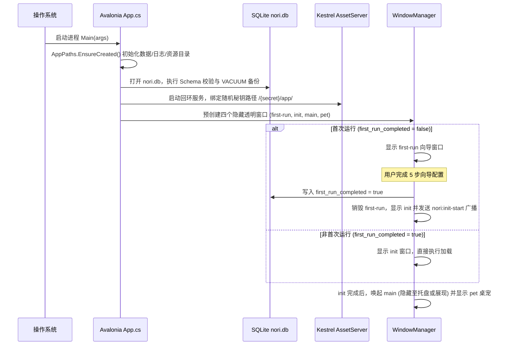

# 系统架构与桥接协议

本文档阐述 Nori Desktop Pet 的底层分层架构、核心启动时序以及宿主与前端之间的桥接协议设计。

---

## 1. 核心模块与职责分工

| 架构层级 | 核心程序集 / 技术栈 | 职责与技术边界 |
| :--- | :--- | :--- |
| **宿主层 (Host)** | `.NET 10` + `Avalonia 12` | 应用生命周期控制、四独立窗口调度、系统托盘管理、NativeWebView 装配与原生桌宠视窗。 |
| **核心层 (Core)** | `Nori.Core` + `SQLite` | 配置存储、Agent 状态机、Living Memory 混合检索、MCP 协议管理、语音服务与平台能力抽象。 |
| **前端层 (Frontend)** | `Vue 3` + `TypeScript` + `UnoCSS` | 首次运行向导、初始化过渡、主控制台、对话视口、设置中心与响应式 UI 状态投影。 |
| **桥接层 (Bridge)** | `NoriBridge` + `BridgeCommands` | JS↔C# 异步命令分发、权限控制、双层 JSON 序列化信封与宿主事件广播。 |
| **资产服务 (AssetServer)** | `ASP.NET Core Kestrel` | 本地回环服务（`127.0.0.1`），同源托管前端生产包、本地模型文件与带时效的音频媒体端点。 |
| **桌宠引擎 (Pet Engine)** | `Live2DCSharpSDK` + `OpenGL ES` | 原生 C# OpenGL 硬件加速绘制、Alpha 动态采样碰撞检测与 4px 拖拽计算。 |
| **插件运行时 (PluginRuntime)**| `Nori.PluginRuntime` | NPS 2.0 单程序集运行时，基于 `AssemblyLoadContext` 的进程内扩展与 `ui.webview` 独立视口。 |

---

## 2. 系统启动与窗口时序

---

## 3. 桥接命令规范与安全拦截

### 3.1 命令调用原则
- **命令命名**：一律采用 `snake_case` 且以动词开头（如 `chat_start`、`model_select`、`settings_update_ai`）。
- **参数结构**：参数一律封装为单层 JSON 对象传递。
- **窗口来源鉴权**：
  - `RequireMain`：仅允许来自 `main` 窗口的调用。
  - `RequireVisibleMain`：仅允许来自当前可见的 `main` 窗口调用（防止隐藏状态下的非预期破坏性操作）。
  - `RequireLabel(WindowLabels.FirstRun)`：仅允许来自首次向导的初始化特权调用。

### 3.2 双层编码 JSON 信封（Double-Encoded Envelope）
宿主向 WebView 广播事件时：
1. 宿主将事件载荷序列化为标准 JSON 文本；
2. 宿主再次将该字符串进行安全的转义打包，通过 `InvokeScript` 发送；
3. 前端接收后调用 `JSON.parse` 还原对象。
这一设计从根本上规避了各平台底层 WebView 字符串转义差异引发的跨端乱码与安全漏洞。
