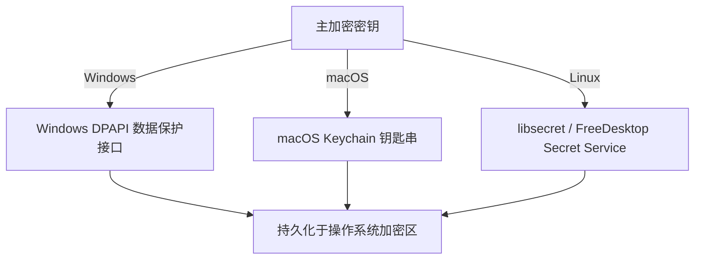

# 安全存储与加密规范

本文档详述 Nori Desktop Pet 中敏感数据加密存储、密钥库集成以及 SQLite 数据库备份与安全防护机制。

---

## 1. 凭据加密标准 (`nsec1:`)

所有用户输入的敏感凭据（如 `*_api_key`、`*_secret`、`*_token`、`*_password`）在持久化至 SQLite 时，均执行 **AES-256-GCM** 认证加密。

### 密文格式

```text
nsec1:<Base64( 12字节 Nonce + 密文 Ciphertext + 16字节 AuthTag )>
```

- **算法**：`AES-256-GCM`（Galois/Counter Mode）。
- **Nonce**：每次加密由安全伪随机数生成器（`RandomNumberGenerator`）独立生成 12 字节随机数，杜绝重放攻击。
- **Auth Tag**：16 字节认证标签，确保密文防篡改。

---

## 2. 平台密钥库与主密钥管理

加密所使用的主对称密钥通过各操作系统的原生安全容器受保护：



### 降级与跨平台策略
- **权限收紧备选**：当系统密钥库服务不可用时，系统回退至严格文件权限控制（Linux/macOS 设为 `0600`，仅当前操作系统用户可读写）。
- **单向只写原则**：UI 状态快照绝不向前端返回明文密码，仅返回 `hasApiKey: true/false`，彻底隔绝 XSS 或 DevTools 内存嗅探泄露。
- **旧格式向后兼容**：在 Windows 上兼容读取历史版本的 `enc:dpapi:` 格式；跨平台迁移时若无法解密仅提示用户重新输入对应项，绝不破坏性清空其他配置。

---

## 3. SQLite 数据库防护与自动备份

- **迁移前自动备份**：在执行任何数据库 Schema 升级迁移前，宿主均自动调用 `VACUUM INTO` 创建独立冷备份。
- **容量与数量硬约束**：
  - 单个备份文件受 **64 MiB** 物理容量上限保护。
  - 自动保留最多 **3 份** 最新历史备份，超出自动滚动清理，防止磁盘空间被无限占用。
